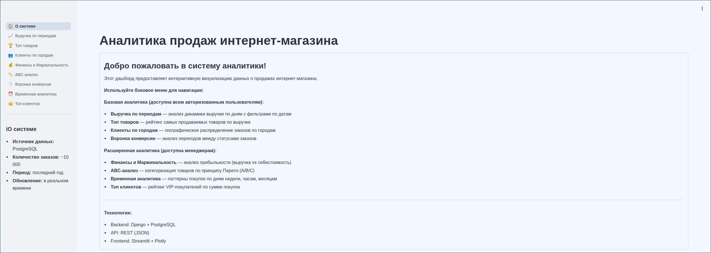
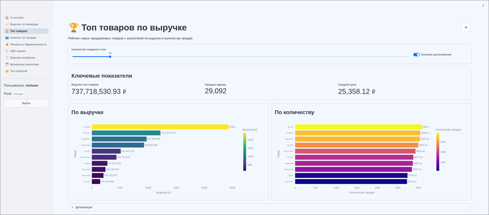
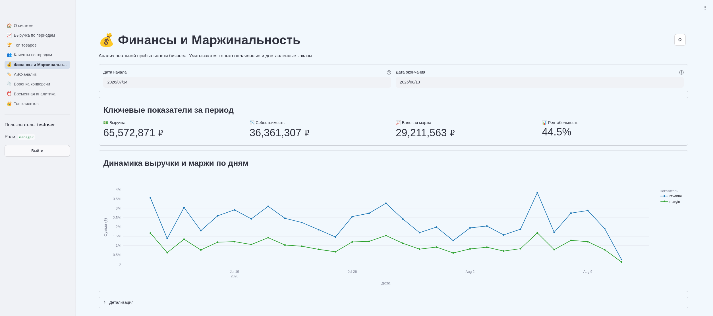
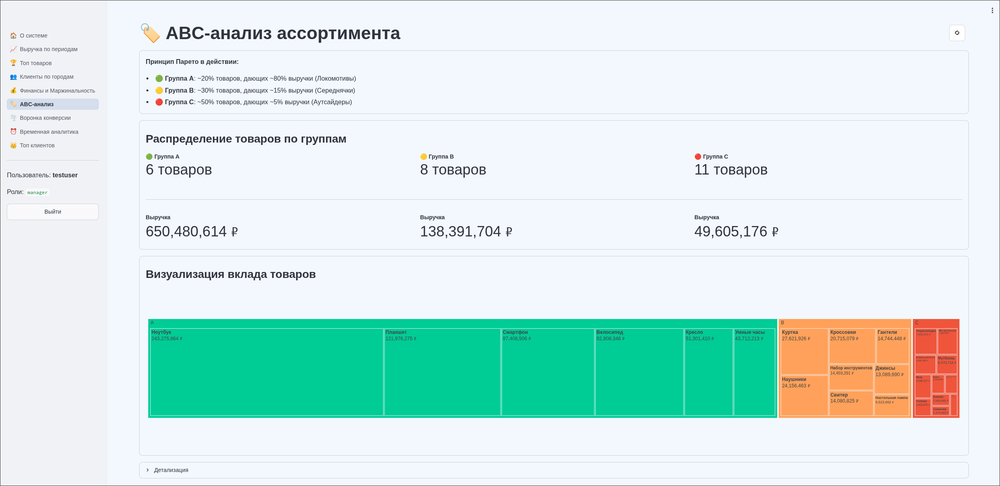
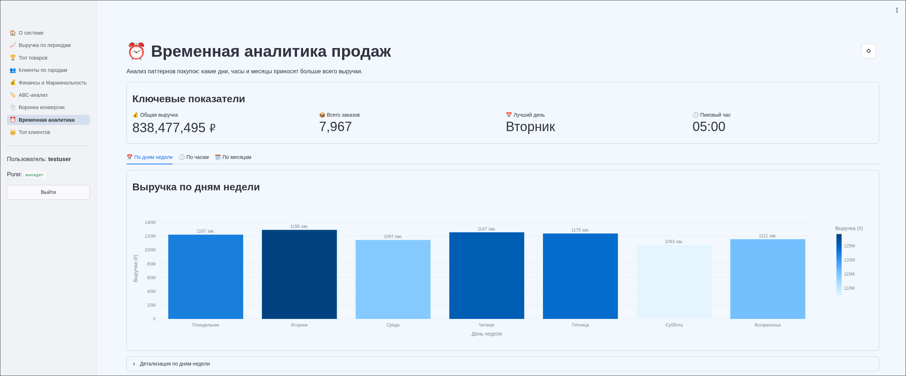

# AnalyticSystem

Аналитическая система для интернет-магазина: Django-API агрегирует данные о заказах в PostgreSQL, а Streamlit-дашборд визуализирует метрики продаж, маржинальности и клиентов.

## Возможности

- **Аналитика:** выручка по периодам, топ товаров, клиенты по городам, воронка конверсии
- **Менеджерские отчёты:** маржинальность, ABC-анализ (Парето 20/80), временная аналитика (дни недели / часы / месяцы), топ клиентов
- **Интерфейс:** 8 страниц аналитики с интерактивными графиками Plotly, кнопка принудительного обновления данных, переключатель «Блочное расположение» (топ товаров, клиенты по городам)
- **Данные:** ETL-конвейер генерации реалистичных тестовых заказов (Faker)

## Скриншоты

### Главная страница дашборда


### Топ товаров по выручке


### Маржинальность


### ABC-анализ ассортимента


### Временная аналитика


## Архитектура

```
┌─────────────────────────────┐      HTTP (JSON)      ┌─────────────────────────────┐
│  dashboard/ (Streamlit)     │ ───────────────────►  │  apps/ (Django API)         │
│  · 8 страниц + главная      │  Authorization: Token │  · analytics — 12 эндпоинтов │
│  · роли analyst / manager   │ ◄───────────────────  │  · auth_api — токены и роли  │
└─────────────────────────────┘                        └──────────────┬──────────────┘
                                                                      │ ORM
                                                             ┌────────▼─────────────┐
                                                             │  PostgreSQL 16        │
                                                             │  catalog / customers  │
                                                             │  orders               │
                                                             └──────────────────────┘
```

- **Django API** — обычные `View`-классы, возвращающие `JsonResponse`; валидация и схемы ответов на **pydantic** (без Django REST Framework).
- **Авторизация** — токены (`auth_api`), роли задаются группами пользователей `analyst` и `manager`.
- **ETL** (`apps/etl`) — генерация и загрузка тестовых заказов через management-команду.

## Стек

Python 3.14 · Django 6 · PostgreSQL 16 · Streamlit · Plotly · pandas · pydantic · Faker · uv · Docker Compose

## Структура проекта

| Путь | Назначение |
|---|---|
| `apps/analytics/` | Агрегирующие SQL-запросы, pydantic-схемы и REST-эндпоинты аналитики |
| `apps/auth_api/` | Токен-авторизация: `AuthToken`, login/logout, `TokenRequiredMixin` |
| `apps/catalog/` | Модели `Category`, `Product` |
| `apps/customers/` | Модель `Customer` |
| `apps/orders/` | Модели `Order`, `OrderItem` |
| `apps/etl/` | Генераторы mock-данных, загрузчик, команда `run_etl` |
| `config/` | Настройки Django (`settings.py`, `urls.py`, `asgi.py`, `wsgi.py`) |
| `dashboard/` | Streamlit-приложение: `app.py`, `pages/`, `components/`, `services/` (auth_guard, api_client) |
| `docker-compose.yaml` | Сервисы `db`, `django`, `dashboard` |

## Быстрый старт

### Docker

1. Создайте `.env` из `.env.example`: `cp .env.example .env`
2. Запустите стек:

```bash
docker compose up --build
```

Сервис `django` сам выполняет миграции при старте.

После старта:

- Дашборд: <http://localhost:8501>
- Проверка API: <http://localhost:8000/analytics/api/revenue/>
- Django admin: <http://localhost:8000/admin>

3. Создайте суперпользователя (в новом терминале):

```bash
docker compose exec analytic-system-api uv run python manage.py createsuperuser
```

4. В админке создайте группы `analyst` и `manager` и добавьте суперпользователя в `manager` — иначе ему будут недоступны менеджерские отчёты (роли проверяются только через группы).

### Локально

```bash
uv sync
cp .env.example .env      # для локального запуска значения подходят сразу
uv run python manage.py migrate
uv run python manage.py createsuperuser
uv run python manage.py run_etl --rows 1000
uv run python manage.py runserver
```

В новом терминале:

```bash
export API_BASE_URL=http://localhost:8000/analytics/api
export AUTH_API_BASE_URL=http://localhost:8000/api/auth
uv run streamlit run dashboard/app.py
```

### Роли пользователей

Роли определяются группами Django (имена групп должны совпадать точно):

- `analyst` — общие отчёты: выручка, топ товаров, клиенты по городам, воронка.
- `manager` — всё выше + маржинальность, ABC-анализ, временная аналитика, топ клиентов.

## Переменные окружения

| Переменная | Описание | По умолчанию |
|---|---|---|
| `POSTGRES_NAME` | Имя БД | `ecommerce_analytics` |
| `POSTGRES_USER` | Пользователь БД | `postgres` |
| `POSTGRES_PASSWORD` | Пароль БД | — |
| `POSTGRES_HOST` | Хост БД (в Docker-сети — `db`) | `db` |
| `POSTGRES_HOST_PORT` | Порт БД на хосте | `5432` |
| `DEBUG` | Django debug-режим | `0` |
| `DJANGO_PORT` | Порт API на хосте | `8000` |
| `ALLOWED_HOSTS` | Разрешённые хосты (через запятую) | `localhost,127.0.0.1` |
| `API_BASE_URL` | Базовый URL API аналитики (для дашборда) | `http://django:8000/analytics/api` |
| `AUTH_API_BASE_URL` | Базовый URL auth API (для дашборда) | `http://django:8000/api/auth` |

В `.env.example` уже указан `POSTGRES_HOST=localhost` — подходит для локального запуска; в Docker-сети он передаётся в контейнер неявно через `db`-сервис.

## API

Авторизация: заголовок `Authorization: Token <token>` (для защищённых эндпоинтов).

| Метод | Путь | Доступ | Параметры |
|---|---|---|---|
| POST | `/api/auth/login/` | открытый | `username`, `password` → `{token, username, roles}` |
| POST | `/api/auth/logout/` | по токену | — |
| GET | `/analytics/api/revenue/` | открытый | `start`, `end` |
| GET | `/analytics/api/top-products/` | открытый | `limit` |
| GET | `/analytics/api/average-check/` | открытый | `start`, `end` |
| GET | `/analytics/api/customers-by-city/` | открытый | — |
| GET | `/analytics/api/funnel/` | открытый | — |
| GET | `/analytics/api/margin/` | manager | `start`, `end` |
| GET | `/analytics/api/margin-by-day/` | manager | `start`, `end` |
| GET | `/analytics/api/abc-analysis/` | manager | — |
| GET | `/analytics/api/revenue-by-day-of-week/` | manager | — |
| GET | `/analytics/api/revenue-by-hour/` | manager | — |
| GET | `/analytics/api/revenue-by-months/` | manager | — |
| GET | `/analytics/api/top-customers/` | manager | `limit` |

Параметры `start`/`end` — даты в ISO-формате (`YYYY-MM-DD`); по умолчанию — последние 30 дней.

## ETL: генерация тестовых данных

```bash
uv run python manage.py run_etl --rows 1000 --batch-size 500 --clear
```

- `--rows` — количество заказов (по умолчанию 1000);
- `--batch-size` — размер батча генерации (по умолчанию 500);
- `--clear` — очистить таблицы заказов/товаров/клиентов перед загрузкой.

Данные генерируются через `Faker('ru_RU')`: русские имена, 15 городов, 5 категорий × 5 товаров, статусы заказов с весами (paid 45%, delivered 35%), себестоимость — 40–70% цены.

## Известные ограничения

1. **Тестовые данные:** из-за весов генерации заказов в статусе `paid` может быть больше, чем `new`. В реальной системе воронка всегда сужается.
2. **Производительность:** при очень большом количестве товаров (>10000) ABC-анализ может работать медленно. Рекомендуется пагинация или кэширование.
3. **Streamlit кэширование:** данные кэшируются на 60 секунд (уровень страниц). Для принудительного обновления есть кнопка «Обновить данные».

## Разработка

```bash
uv run ruff check .                    # линтер
uv run ruff format --check .           # проверка форматирования
uv run mypy .                          # проверка типов
uv run python manage.py test           # тесты Django
```

## Лицензия

MIT — см. файл [LICENSE](LICENSE).